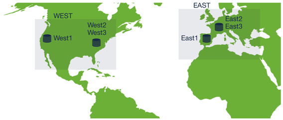
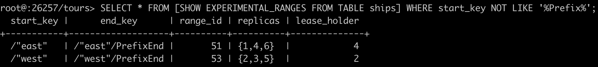

# CockroachDB

Im folgenden Beispiel wollen wir Seereisen rund um den Globus anbieten. Dabei konzentrieren wir uns auf die Märkte Europa und Nordamerika.
In jedem dieser Märkte befinden sich zwei Standorte. Pro Markt sollen dedizierte Reisen verkauft werden, d.h. für den Markt Nordamerika Reisen in der Karibik
und Europa im Mittelmeer. Dafür richten wir ein Cockroach Clusters mit 2 Regionen á 3 Nodes. Wie in der Abbildung zu sehen, besteht das Cluster aus der Zone 'West' für Nordamerika mit den Knoten West1-3 und äquivalent dazu die Zone 'East' für Europa. Dabei ist zu beachten, dass jeweils die Knoten 2 und 3 jeder Zone in einem *Datacenter* laufen. Es liegt auf der Hand, dass in der Region *West* andere Schiffe als in Europa zum Einsatz kommen. Um die Vorzüge der CockroachDB ausnutzen zu können, werden die Schiffsdaten so repliziert, dass sie in der jeweiligen Region, in der sie eingesetzt werden, vorgehalten werden.



## Voraussetzungen

* Docker

## Dokumentation

* [Replication Zones](https://www.cockroachlabs.com/docs/stable/configure-replication-zones.html)
* [Geo Partitioning](https://www.cockroachlabs.com/docs/stable/partitioning.html)
* [Start Cluster with Docker](https://www.cockroachlabs.com/docs/stable/start-a-local-cluster-in-docker.html)

## Installation

1. Netzwerk erstellen.

    ```bash
    docker network create -d bridge tours
    ```

2. Container in der Zone *east* erstellen.

    ```bash
    docker run -d \
    --name=east1 \
    --hostname=east1 \
    --net=tours \
    -v "${PWD}/cockroach-data/east1:/cockroach/cockroach-data"  \
    -p 127.0.0.1:26257:26257 \
    -p 8080:8080 \
    cockroachdb/cockroach:latest start --insecure --locality=region=east,datacenter=east1 --join=east1,east2,east3,west1,west2,west3
    ```

3. Einen zweiten Container in der Zone *east* erstellen. \
    `--join` fügt Container dem Cluster hinzu. \
    `--locality` setzt das geographische Flag.

    ```bash
    docker run -d \
    --name=east2 \
    --hostname=east2 \
    --net=tours \
    -v "${PWD}/cockroach-data/east2:/cockroach/cockroach-data"  \
    -p 127.0.0.1:26258:26257 \
    cockroachdb/cockroach:latest start --insecure --join=east1,east2,east3,west1,west2,west3 --locality=region=east,datacenter=east2
    ```

4. Einen dritten Container in der Zone *east* erstellen.

    ```bash
    docker run -d \
    --name=east3 \
    --hostname=east3 \
    --net=tours \
    -v "${PWD}/cockroach-data/east3:/cockroach/cockroach-data"  \
    -p 127.0.0.1:26259:26257 \
    cockroachdb/cockroach:latest start --insecure --join=east1,east2,east3,west1,west2,west3 --locality=region=east,datacenter=east2
    ```

5. Container in der Zone *west* erstellen.

    ```bash
    docker run -d \
    --name=west1 \
    --hostname=west1 \
    --net=tours \
    -v "${PWD}/cockroach-data/west1:/cockroach/cockroach-data"  \
    -p 127.0.0.1:26260:26257 \
    cockroachdb/cockroach:latest start --insecure --join=east1,east2,east3,west1,west2,west3 --locality=region=west,datacenter=west1
    ```

6. Einen zweiten Container in der Zone *west* erstellen.

    ```bash
    docker run -d \
    --name=west2 \
    --hostname=west2 \
    --net=tours \
    -v "${PWD}/cockroach-data/west2:/cockroach/cockroach-data"  \
    -p 127.0.0.1:26261:26257 \
    cockroachdb/cockroach:latest start --insecure --join=east1,east2,east3,west1,west2,west3 --locality=region=west,datacenter=west2
    ```

7. Einen dritten Container in der Zone *west* erstellen.

    ```bash
    docker run -d \
    --name=west3 \
    --hostname=west3 \
    --net=tours \
    -v "${PWD}/cockroach-data/west3:/cockroach/cockroach-data"  \
    -p 127.0.0.1:26262:26257 \
    cockroachdb/cockroach:latest start --insecure --join=east1,east2,east3,west1,west2,west3 --locality=region=west,datacenter=west2
    ```

## Einrichtung

1. Datenbank *tours* anlegen und mit Daten füllen.

    ```bash
    docker exec -it east1 ./cockroach init --insecure
    docker exec -it east1 ./cockroach sql --insecure
    ```

    [SEED](./seed/seed.sql)

2. Anschließend wollen wir Replication Zones erstellen, damit in jedem Datacenter alle Ranges einmal vorhanden sind - d.h. wir haben 4 Replicas pro Range. Der *constraints* Anweisung kann hierbei eine JSON mitgegeben werden, die die Verteilung der Replicas auf die verschiedenen Regionen verteilt - hier 50/50. `+` ist dabei verpflichtend, hingegen `-` verboten.

    ```sql
    ALTER DATABASE tours CONFIGURE ZONE USING constraints = '{ "+region=west" : 2, "+region=east" : 2}', num_replicas = 4;
    ```

3. Zur Verwendung der geographischen Partionierung ist eine Enterprise Lizenz erforderlich. Zu Testzwecken kann eine Trial License eingespielt werden.

    ```sql
    SET CLUSTER SETTING cluster.organization = 'Cockroach Labs Training';
    SET CLUSTER SETTING enterprise.license = 'crl-0-EIDA4OgGGAEiF0NvY2tyb2FjaCBMYWJzI';
    ```

4. Partitionieren der Schiffsdaten anhand ihres Einsatzgebiets. Anschließend werden den Partitionen die entsprechenden Zonen zugewiesen. Dabei soll der *Leaseleader* im Datacenter mit den beiden Nodes laufen.

    ```sql
    ALTER TABLE ships
        PARTITION BY LIST(location) (
        PARTITION east VALUES IN ('east'),
        PARTITION west VALUES IN ('west')
    );

    SHOW EXPERIMENTAL_RANGES FROM TABLE ships;

    ALTER PARTITION east OF TABLE tours.ships CONFIGURE ZONE USING CONSTRAINTS='[+region=east, -region=west]', lease_preferences = '[[+datacenter=east2]]', num_replicas = 3;
    ALTER PARTITION west OF TABLE tours.ships CONFIGURE ZONE USING CONSTRAINTS='[+region=west, -region=east]', lease_preferences = '[[+datacenter=west2]]', num_replicas = 3;
    ```

    Nach wenigen Minuten warten können wir überprüfen, auf welchen Nodes die Partitionen vorhanden sind. Die verwendeten IDs sind der *ClusterOverview* zu entnehmen (siehe nächster Schritt).

    ```sql
    SELECT * FROM [SHOW EXPERIMENTAL_RANGES FROM TABLE ships] WHERE start_key NOT LIKE '%Prefix%';
    ```
    
    

5. Kontrolle der Synchronisation

    Über die [Management Console](http://localhost:8080) kann der aktuelle Status der Synchronisation überprüft werden. Dabei sollten in der *Overview* alle *Nodes* aufgelistet werden. Unter den [Debugging Optionen](http://localhost:8080/#/debug) können weiterführende Informationen über Ranges, Raft Status und Zonen Konfiguration entnommen werden.

## Clean up

Docker Container stoppen und entfernen.

```bash
docker stop east1 east2 east3 west1 west2 west3
docker rm east1 east2 east3 west1 west2 west3
docker network rm tours
rm -r ./cockroach-data
```
